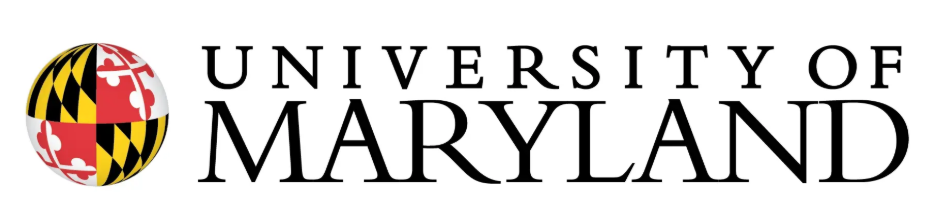
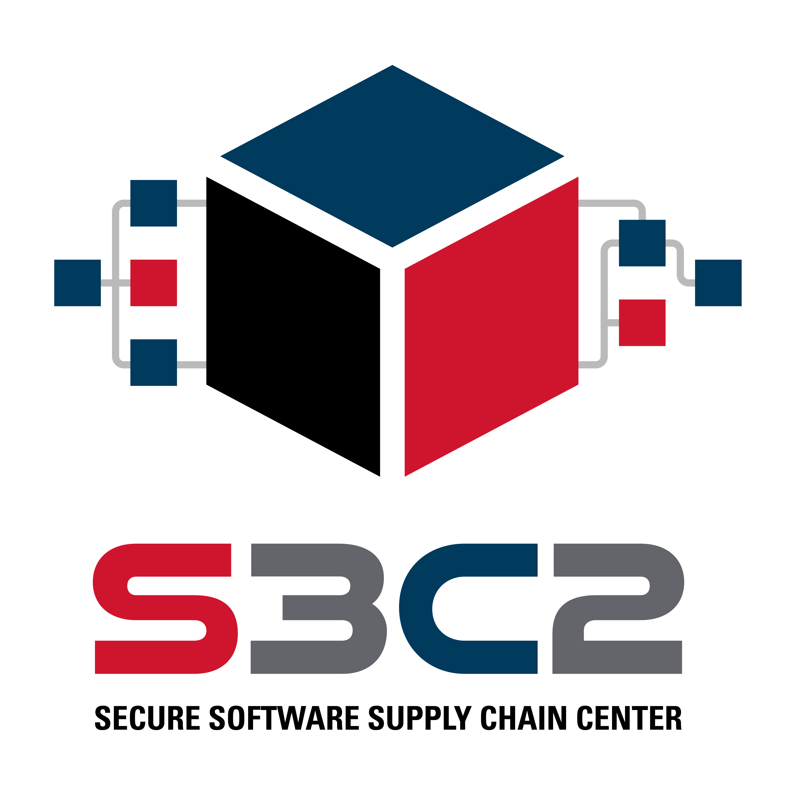

  

SECURE IT Academy is a collection of free teaching material that teaches Cybersecurity concepts and cybersecurity safety through online and unplugged lessons. 

## Documentation

## Contributing

## Sponsors

Thank you to the following organizations for supporting this project:

  
   
   
   
  
   
   
   
  
   
   
   
  

